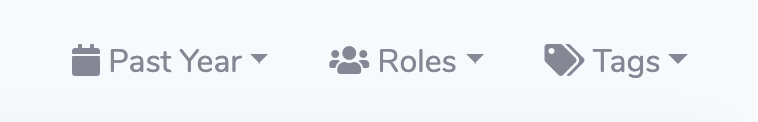

## Getting Started with Savannah

To start tracking your community with Savannah, you will need to [Create a new Community](https://savannahhq.com/community/new) by providing a name and logo.

Your Logo should be a square or roughly square image, at least 64x64 px in size.

### Adding Sources and Channels

Your first task after creating a new Community is to add a data source and channels to it. You will see this message at the top of your screen until you've done that. Click the `Sources` button in the prompt to go to where you can add your first `Source`.

Click the `Add` button on the right hand side to see a list of sources you can import data from. Each option will prompt you for additional information specific to that source.

Once you've added a `Source`, you will be shown a list of `Channels` available in it. These could be Slack channels, Github repos or Discourse categories, depending on your `Source` type. Savannnah will only import data from those channels that you choose to track in order to let you decide what data you're interested in tracking.

> Savannah imports data once every hour. It may take up to an hour before you begin to see data from your community.

## Navigating your new Community

While your data is being imported, take a moment to familiarize yourself with the basic layout of Savannah. These components will be on every screen, allowing you quick access to all the most commonly used functionality.

### Filtering your view

Most pages in Savannah can be filtered by a time range, by a Member's `Role` (Community, Staff or Bot) or by the `Tag` associated with the Member, Conversation or Contribution.

Filters are saved to your session, so once you apply them they will follow you from one page to another until they are cleared.

## Managing your Community

### Merging Member Identities

### Assigning Roles to your Members

### Creating your own Tags

### Using Projects

### Adding other Managers

