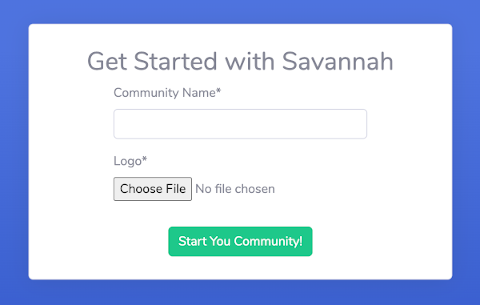
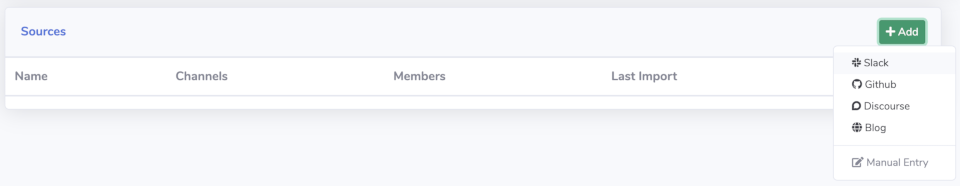
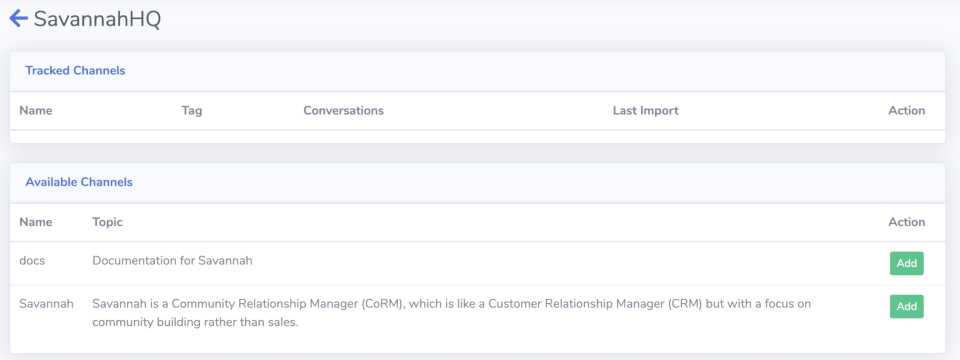
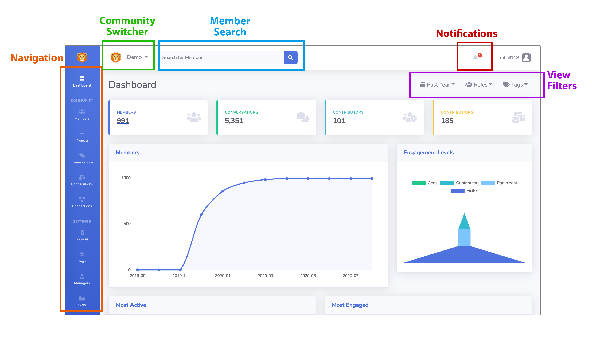
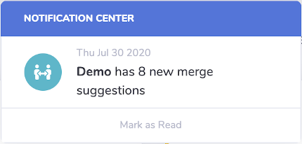
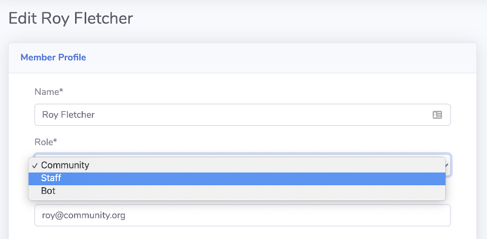
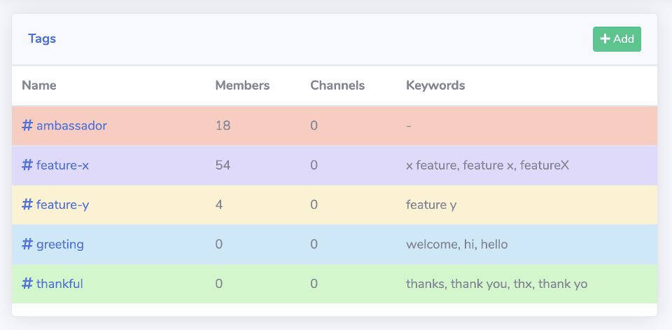
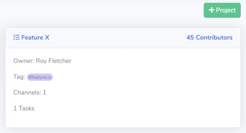
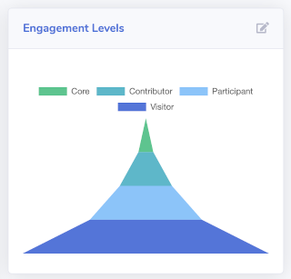
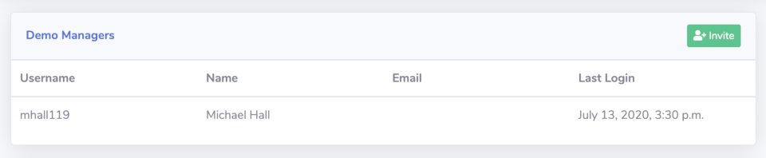

## Getting Started with Savannah

To start tracking your community with Savannah, you will need to [Create a new Community](https://savannahhq.com/community/new) by providing a name and logo.

Your Logo should be a square or roughly square image, at least 64x64 px in size.

### Adding Sources

Your first task after creating a new Community is to add a data source and channels to it. You will see this message at the top of your screen until you've done that. Click the `Sources` button in the prompt to go to where you can add your first `Source`.

Click the `Add` button on the right hand side to see a list of sources you can import data from. Each option will prompt you for additional information specific to that source.

### Adding Channels

Once you've added a `Source`, you will be shown a list of `Channels` available in it. These could be Slack channels, Github repos or Discourse categories, depending on your `Source` type. Savannnah will only import data from those channels that you choose to track in order to let you decide what data you're interested in tracking.

> Savannah imports data once every hour. It may take up to an hour before you begin to see data from your community.

## Navigating your new Community

While your data is being imported, take a moment to familiarize yourself with the basic layout of Savannah. These components will be on every screen, allowing you quick access to all the most commonly used functionality.

### Filtering your view

Most pages in Savannah can be filtered by a time range, by a Member's `Role` (Community, Staff or Bot) or by the `Tag` associated with the Member, Conversation or Contribution.

Filters are saved to your session, so once you apply them they will follow you from one page to another until they are cleared.

## Managing your Community

Savannah's goal is to make your life simpler, not give you more work, so it automates as much as possible.
However, there are some things that require your specific knowledge and experience to really bring out the full power of what Savannah can do for you.

### Merging Member Identities

As soon as you start importing data from more than one source, say Github *and* Slack, you're going to run into the problem of having two separate accounts for the same community member. Since you want to track all of that member's activity together, you will need to tell Savannah when two accounts belong to just one person.

Luckily Savannah makes this easy! It will periodically look for likely matches based on details like username, email address or even full name matching, and suggest them to you for merging. When you see a notification like this, that means Savannah is *pretty sure* it's found two identities of the same person, and lets you quickly accept or reject it's suggestions.

### Assigning Roles to your Members

One of Savannah's guiding principles is that anybody who interacts with anybody in your community is part of that community. That's why it tracks activity from employees and even bots, and includes them in visualizations and reports. But looking at each of these groups individually also has value, which is why filtering by `Role` is built into most Savannah pages.

In order to take advantage of this feature you will need to specify which members of your community are Staff or Bots by going to their Member Profile page and clicking the `Edit` button. Everybody is set as Community by default, so you will only need to do this for Bots and Staff.

### Creating your own Tags

Tags allow you to filter people and activity based on areas of interest to you.  Tags can be manually applied to any Member in your community, and automatically applied to Conversations and Contributions based on keyword matching.

Create your own tags for any programs, features or topics that you might want to see on their own. For example, if you have an Ambassadors program, create a tag for it and apply that to your Members, then you can see activity from just your Ambassadors. Or if you have a specific feature in your product and you want to see who is talking about it, create a tag with keywords to match against conversations happening anywhere in your community. 

Savannah creates two for you to start with: **greeting** and **thankful**. These tags will classify conversations between your Members so you can track how welcoming and appreciative your community is.

### Using Projects

Projects give you another way of defining segments of your community that you want to track independently from the whole. These can target specific products or services that you offer, or outreach programs that you run, by choosing which Channels and Tags to treat as activity for that Project. You can even add Tasks for yourself to track work items you need to do for it!

Projects will automatically identify your **Core** members and **Contributors**, as well how many **Participants** and **Visitors** you have for that project. Similar to a sales funnel, this lets you track how well you are doing getting people onboarded in your community and whether or not they are progressing to more involved levels.

Your community will start with a default Project that covers all of your channels and tags.

### Adding other Managers

Whether you are Community Team of one or many, you're going to want to share access to your community insights with other people in your company or project. Savannah makes it easy to add more managers to your community by sending them an email invitation. Once they sign up using the link in the email, they will be added as a manager of your community. 

