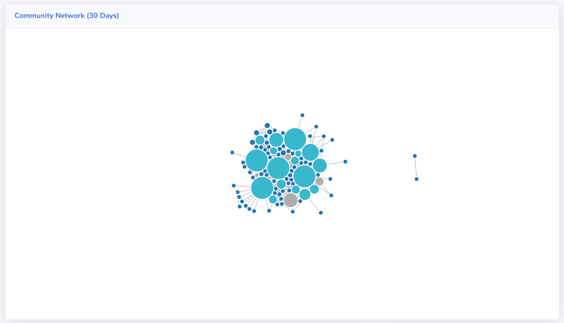
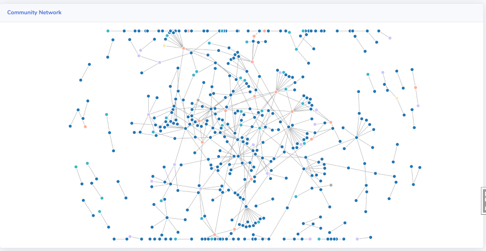
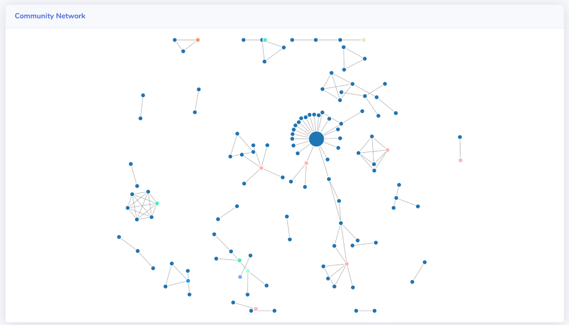
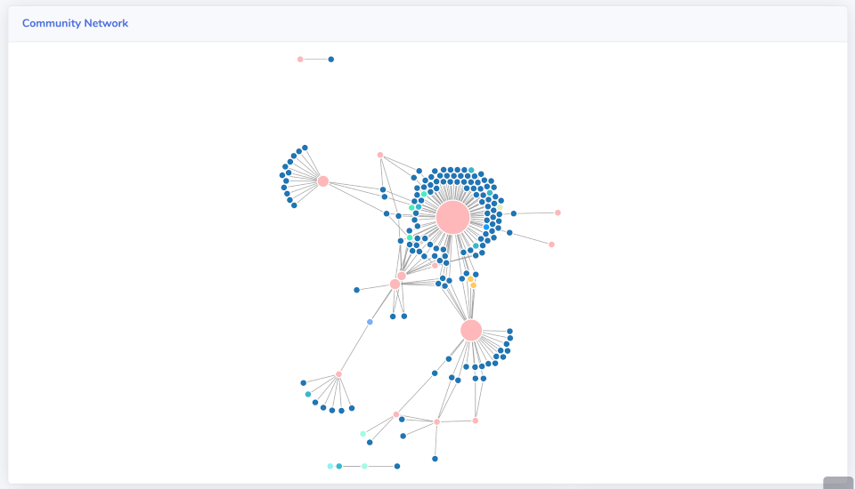
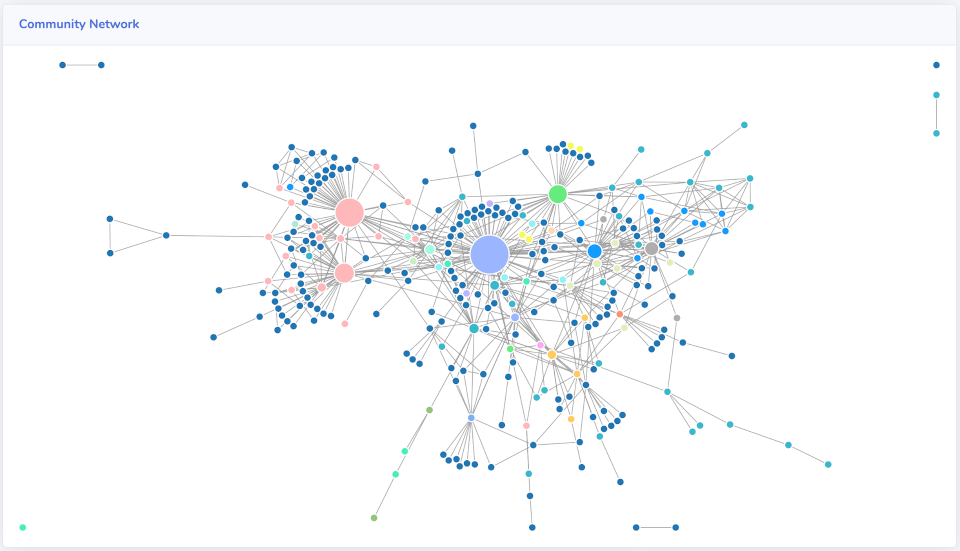

# Understanding your Connections graph

Many aspects of community health are impossible to quantify, but that doesn't mean they can't be better understood with data. Sometimes visualizing that data gives more insights than you can get from simply counting it.

Savannah's Community Network graph is a great example of this. While other pages show you the number of connections a person has, or who has the most, you can't really get a sense of the community as a whole until you can see how all those relationships are binding (or not) your community together. Because this isn't a quantifiable property of your community there's no way to give target numbers for what a healthy community should have. Instead we have to look at the shape and patterns of different communities, and make qualitative judgements about what they mean. 

Below are some of the most common shapes that your Community Network graph might show. In each we will discuss both the meaning behind them, and what recommended actions you should take as a Community Manager based on them.

## Tightly bound

If your community has a small number of members who all participate in the same discussions, the graph will show a tight bundle of nodes dominated by a small set of roughly the same size. In this kind of community there is a small "team" of people who all equally involved in all of its aspects. This indicates that your community has not yet branched out into areas of focus or that your community leaders have not yet begun to concentrate their efforts on those areas.

Such a tighty-bound community is common for small or young communities, where it's more likely that everybody will be involved in everything that is happening, but it means that your community is not yet scalable to accommodate a larger number of people. This is both because it depends on a small number of **very active** participants, and also because it's harder for somebody new to the community to find a place to fit in with such a tightly bound group.

At this stage you should be encouraging your leaders to take on more individual responsibilities in specific areas of your project. This will allow them to grow those areas without requiring the involvement of **all** your very active participants, and give new members a place to join that doesn't require them breaking into a tight group. Think of it like introducing somebody new to your personal group of friends, you don't want them to have to be friends with everybody at the start, that would be overwhelming, instead you want them to be able to come in with only one or two connections, and build up relationships with the others over time.

## Loosely bound

The opposite extreme is a very loosely bound community. If a community is loosely bound, there are more people but few leaders, which means that the community is depending on a larger number of less involved participants. In this case your network graph will show a mostly uniform distribution of connections, and nodes all of the same size. This indicates a lack of leaders who will bring larger groups together around shared interests.

While this is more sustainable, as an increase in community members will be supported by a large number of active members who are spread throughout the community, new members will have a harder time finding the right people to connect with. Without anybody standing out as "the person" for a given topic new members are often left without guidance, which is a barrier to them getting more deeply involved in your community.

When you have a large, but loosely bound, community you want to encourage people to take on leadership roles within their existing areas, to form the nucleus around which others in the community can gather. Identifying and supporting these new leaders with mentoring and resources should be your focus as community manager.

## Isolated groups

In a community with small, isolated groups there are more people with fewer connections, which means your community as a whole is not well connected.  Your network graph in this case will show a scattered set of clusters consisting of only a handful of members in each. There won't be many large nodes because few people are connecting to more than just that handful of others. 

While this makes it easier for a new member to break into your community, it makes it a lot harder to keep them there, as they won't be building the kinds of relationships that are necessary to sustain a sense of community. It doesn't matter to them if your community has hundreds of active members because they're only ever going to interact with a few of them.

If you have a isolated groups in your community you should start looking for areas of shared interest among these groups, and identifying potential leaders who can sustain and grow the number of connections within their group. As the community manager you want to act as match-maker between unconnected members, to form connections between exiting groups as well as between new members and groups of interest to them. Once enough people are interconnected around a shared interest, they will produce the social "gravity" for sustainable growth.
 
## Heroes

When strong leaders emerge in your community they become highly connected without being tightly bound. That means they are interacting with a large number of other members in your community, usually individually or with only a few others.

Heroes, rock stars, whatever we call them, these people are necessary to sustain a large and healthy community. They combine the clear leadership connections of a tightly bound community, with the ease of entry of a loosely bound one. Heroes are usually the most active, most enthusiastic, and most helpful members of your community. They are the ones you rely on to keep things running and to start new initiatives. But they have their drawbacks too, if you're not careful they can easily become gatekeepers or bottlenecks, and they will quite often burn themselves out.

The main thing to watch out for is connections becoming solely concentrated around your heroes. Remember that community is about building a web relationships, not a cult of personality. If the majority of your community has only one connection, and it's to a hero, then your hero isn't helping build those relationships. When this happens you should work on distributing your hero's responsibilities to more people, by building up other leaders who they can delegate to or establishing teams that take a collective resonsibility rather than an individual one.

## Networks of Community

In the previous sections we talked about different shapes for communities, but those examples were largely stereotypes. They provide useful distinctions by emphasizing specific patterns and problems, but in reality your community is not going to fit neatly into just one of them. Instead your community is likey to be composed of many of those examples, with subsets that align more or less to one of these patterns. Each of these subsets acts in some ways as it's own community, but at the same time is interconnected with other subsets, usually through a small set of key people (particularly the community managers) who act as the glue between them.

> Tip: Using Member Tags in Savannah helps you distinguish areas of interests in your Community Network graph. 

What works for one may not work for another, especially when they are in different stages of health and maturity, but the explanations and advice given inthe above sections can then be applied to these subsets of your community, giving you a roadmap for how to help each of them individually. Correctly identifying which parts of your community match which patterns will make your efforts more efficient **and** more effective.
