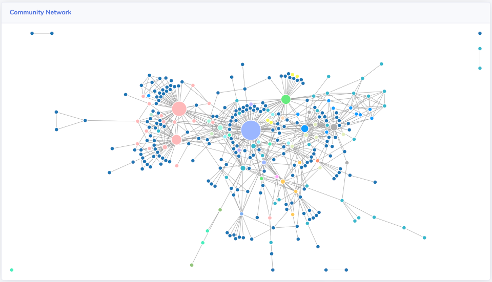

# Gaining insights into your community

Metrics and data are great, but what are they actually telling you about your community? Learn what Savannah is telling, and how you should respond to that to keep it healthy and growing.

## Engagement Levels

(This page is a work in progress, more documentation will be coming soon)

## Connections Network

The Network Graph of your [Connections page](../pages/connections/) is more than just a visualisation of how your community is interconnected, it's shape and structure conveys deeper meanings about how your community is organizing itself. Identifying these meanings will help you know what actions to take to keep your community healthy and growing.

* [What is your Network Graph telling you?](./connections/)

