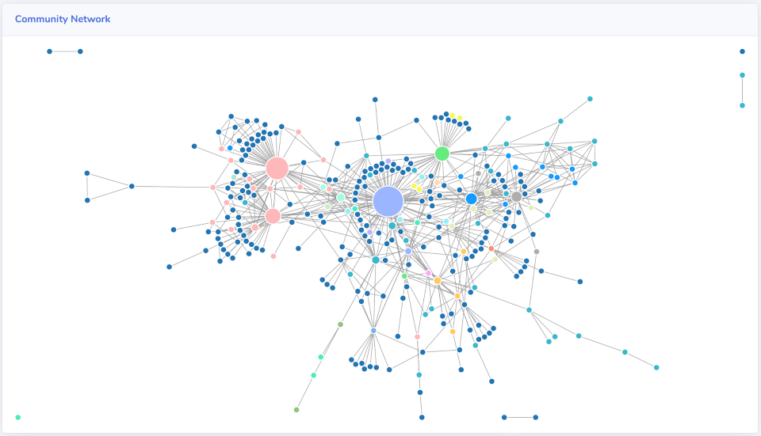

# Connections

## What are Connections?

Connections are a powerful way to measure the health of your community, because it's actual relationships between people that are really the heart of community.

Savannah treats any direct communication between two people as a Connection. Below is a table describing the way connections are recorded for each Source that Savannah provides.

| Source    | Connection from |
|-----------|-------------------|
| Slack     | @tagging a member or responding in a thread that the member is also in. |
| Discourse | @tagging a member or responding in a topic that member is also in. |
| Discord   | @tagging a member. |
| Github    | @tagging a member or responding in an Issue or Pull Request that member is also in. |
| Gitlab    | @tagging a member or responding to an Issue or Merge Request that member is also in. |
| Blog      | Commenting on an article that member has written or commented on (requires RSS comments feed) |
| API       | Any member listed as a `participant` in a Converation |

## Network Graph

The network graph can produce valuable insight about the health of the online community. 

Each node is a member and each line is a connection between 2 members. These 2 members can have at most **one** connection between them, which means that they have interacted, at least once, within the time range give. The more connections a member has, the larger their node will appear in the graph. 

> Tip: You can hover over a member's node to display their name.

Savannah applies a _repulsive_ force between people and an _attractive_ force for each line of connection. That means that the more interconnected a set of Members is, the more closely groups their nodes will be in the network graph.

See [Understanding your Connections graph](/insights/connections/) for insights on using this graph.

